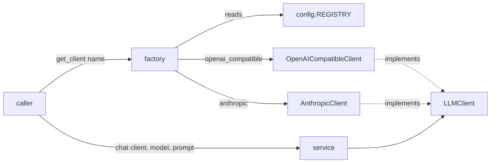

# llm package - low-level design

A small client library for talking to any LLM - hosted (OpenAI, xAI, Anthropic)
or self-hosted (Ollama, vLLM, LM Studio, text-generation-webui, or any other
server that speaks the OpenAI chat-completions API).

## Goals

- One call site (`get_client` + `chat`) regardless of backend.
- Adding a self-hosted server should never require touching this package -
  `provider="custom"` + `base_url` is enough.
- Adding a new *named* hosted provider should be a one-line registry entry,
  not a new call site for consumers.

## Components

```
llm/
  types.py                       Message, ChatResponse, Usage - plain DTOs
  exceptions.py                  LLMError and its subclasses
  base.py                        LLMClient - the interface all providers implement
  config.py                      REGISTRY: provider name -> ProviderConfig
  providers/
    openai_compatible.py         OpenAICompatibleClient - OpenAI, xAI, Ollama, custom
    anthropic_client.py          AnthropicClient - native Messages API
  factory.py                     get_client() - resolves a provider name to a client instance
  service.py                     chat() / chat_with_messages() - the functions callers actually use
  __init__.py                    loads .env, re-exports the public API
```



## Why two provider classes instead of one

OpenAI, xAI, and every self-hosted option in practice all implement the same
`/v1/chat/completions` wire format, so `OpenAICompatibleClient` covers all of
them with just a `base_url` swap. Anthropic's native API uses a different
shape (separate `system` field, different response envelope, required
`max_tokens`), so it gets its own class. Both classes implement the same
`LLMClient.chat()` interface, so `factory.py` and `service.py` don't care
which one they got.

## Adding a new self-hosted server

No code change needed:

```python
client = get_client("custom", base_url="http://my-server:8000/v1", api_key="none")
chat(client, "my-model", "hello")
```

## Adding a new named hosted provider

Add one line to `config.REGISTRY` (and a subclass only if it isn't
OpenAI-compatible):

```python
REGISTRY["together"] = ProviderConfig("openai_compatible", "https://api.together.xyz/v1", "TOGETHER_API_KEY")
```

## Error handling

All errors subclass `LLMError`, so callers who don't care about the specific
cause can just do:

```python
try:
    reply = chat(client, model, prompt)
except LLMError as e:
    ...
```
